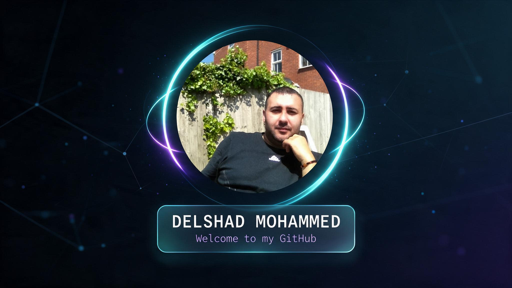

  

  

---

## About Me

I enjoy exploring ideas, learning new skills and creating useful things.

Some of my work is currently private, so more details will be shared at the right time.

## Currently

- Exploring new ideas.
- Learning and improving.
- Building privately.
- Experimenting with technology.

---

  

